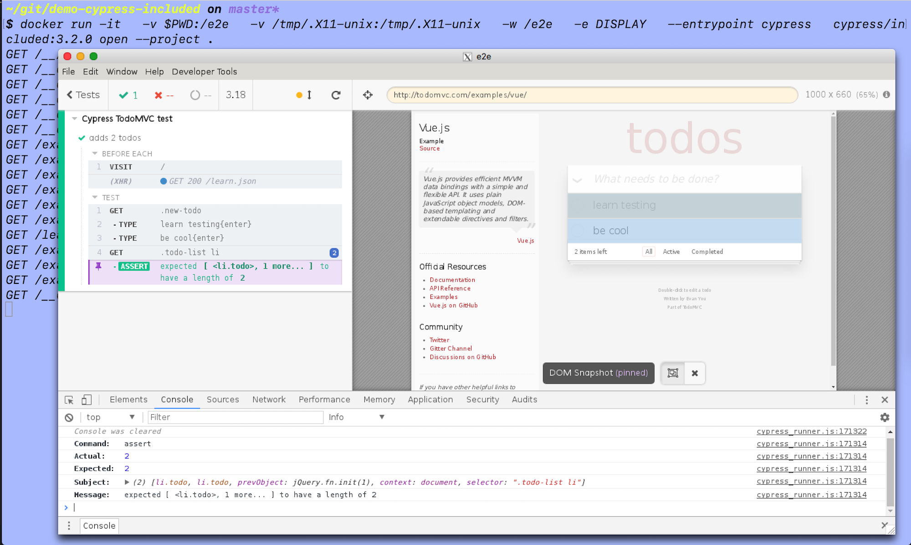

# demo-docker-cypress-included [](https://circleci.com/gh/bahmutov/demo-docker-cypress-included/tree/master)

> Demo running complete Docker image cypress/included

## Run tests

```shell
$ ./cy-run.sh
```

See script [cy-run.sh](cy-run.sh) for the exact `docker run ...` command.

```text
$ ./cy-run.sh
Running Cypress e2e tests headlessly

==============================================================================

  (Run Starting)

  ┌──────────────────────────────────────────────────────────────────────────┐
  │ Cypress:    3.2.0                                                        │
  │ Browser:    Electron 59 (headless)                                       │
  │ Specs:      1 found (spec.js)                                            │
  └──────────────────────────────────────────────────────────────────────────┘

──────────────────────────────────────────────────────────────────────────────

  Running: spec.js...                                                                      (1 of 1)


  Cypress TodoMVC test
    ✓ adds 2 todos (1351ms)

  ...
```

## See help

- specify entrypoint to be just `cypress`
- pass any arguments after the image name

Example: shows help

```shell
$ docker run -it -v $PWD:/e2e -w /e2e --entrypoint=cypress cypress/included:3.2.0 help
```

## See Cypress info

You can see the information about the Docker image by running [cypress info](https://on.cypress.io/command-line#cypress-info) command

```shell
$ docker run -it -v $PWD:/e2e -w /e2e --entrypoint=cypress cypress/included:6.2.1 info
Displaying Cypress info...

Detected 2 browsers installed:

1. Chrome
  - Name: chrome
  - Channel: stable
  - Version: 87.0.4280.66
  - Executable: google-chrome

2. Firefox
  - Name: firefox
  - Channel: stable
  - Version: 82.0
  - Executable: firefox

Note: to run these browsers, pass <name>:<channel> to the '--browser' field

Examples:
- cypress run --browser firefox
- cypress run --browser chrome

Learn More: https://on.cypress.io/launching-browsers

Proxy Settings: none detected
Environment Variables:
CYPRESS_CACHE_FOLDER: /root/.cache/Cypress

Application Data: /root/.config/cypress/cy/development
Browser Profiles: /root/.config/cypress/cy/development/browsers
Binary Caches: /root/.cache/Cypress

Cypress Version: 6.2.1
System Platform: linux (Debian - 10.5)
System Memory: 2.09 GB free 534 MB
```

### Running in a browser

Since we see that Chrome and Firefox browsers are pre-installed in the container, let's run tests using Firefox for example

```shell
$ ./cy-run.sh --browser firefox
```

## Cypress open

Follow [Running GUI applications using Docker for Mac](https://sourabhbajaj.com/blog/2017/02/07/gui-applications-docker-mac/) and install [XQuartz](https://www.xquartz.org) X11 server. Then see [cy-open.sh](cy-open.sh) for Docker run command that forwards XVFB events from Cypress to the X11 server running on the host machine. You should see Cypress Test Runner open and work fine.



## Cypress plugins

If your project uses [Cypress plugins](https://on.cypress.io/plugins) and they are declared inside [package.json](./package.json) file, then they should be installed before launching Cypress using Docker. For example this project uses [cypress-axe](https://github.com/component-driven/cypress-axe) plugin.

Before running the tests

```shell
npm install
./cy-run.sh
```

Note: if any plugins use native extensions, they would need to be installed under exactly the same environment as the Cypress included Docker image that runs them.
